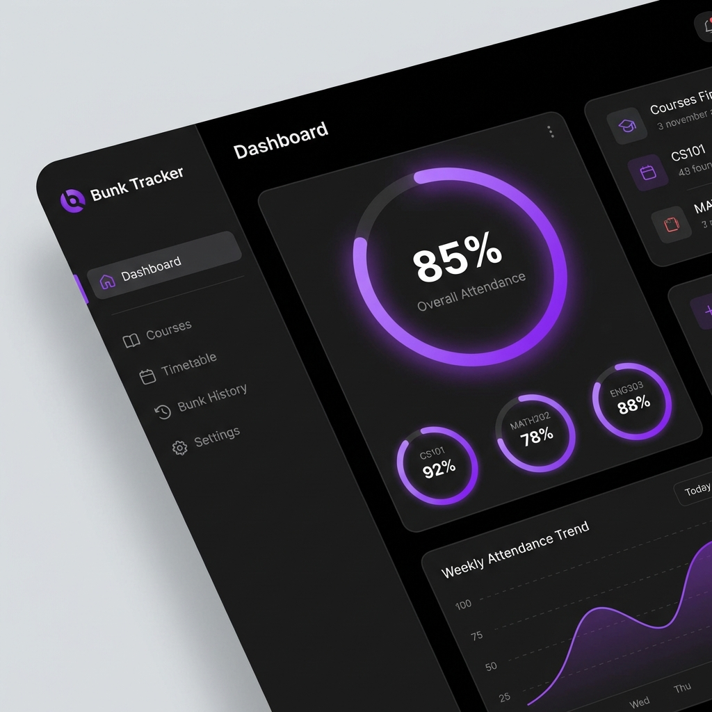

  

  
  
  

 

<h2 align="center">⚡ Tech Stack</h2>

  

 

<!-- STATS SECTION -->
<h2 align="center">🔥 Coding Stats</h2>

  

    <!-- GitHub Stats -->
    
    <!-- LeetCode Stats -->
    
  

   
  

 

<!-- PROJECTS SECTION -->
<h2 align="center">🚀 Featured Projects</h2>

| **Hostel Approval System** | **Exam Timetable Scheduler** | **Hostel Leaving App** |
|:---:|:---:|:---:|
|  |  |  |
| **Streamlines hostel permissions**   _React, Node.js_ | **Automated Exam Scheduling**   _Python, Algorithms_ | **Bunk Tracker**   _Web Stack, Firebase_ |
| [💻 Code](https://github.com/akil-07/sec-Hostel-Approval) • [🌐 Live](https://akil-07.github.io/sec-Hostel-Approval/) | [💻 Code](https://github.com/akil-07/sec-exam-timetable) • [🌐 Live](https://akil-07.github.io/sec-exam-timetable/) | [💻 Code](https://github.com/akil-07/BUNK-TRACKER-SEC) • [🌐 Live](https://akil-07.github.io/BUNK-TRACKER-SEC/) |

 

  

